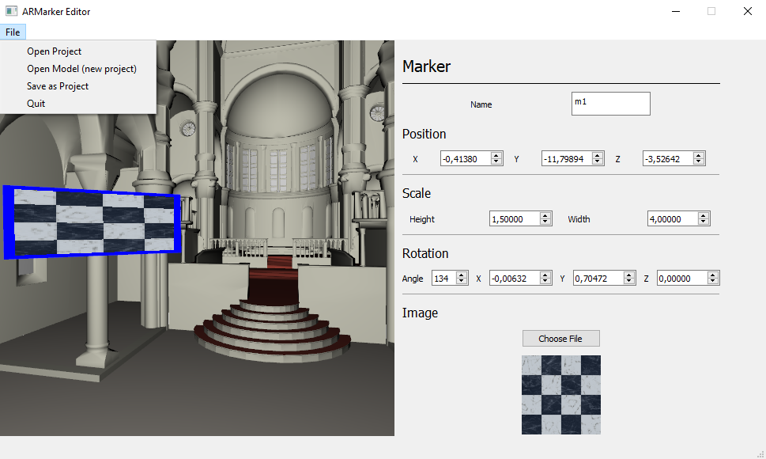

# ARMarkerEditor
Assistant program for an [Android Augmented Reality app](https://github.com/Machinezero/ARMarker) which uses Vuforia for multiple marker recognition to view large 3D virtual scenes. This assistant app is used to build AR projects that can be read by the Android App.

## Tools Used
* OpenGL 
* [Assimp](http://www.assimp.org/)
* [Qt](https://www.qt.io/) 

## Requirements
* Qt 5.8.0

## Installation
Open the Project with Qt. The compiler used in development was MinGW 32 bit.

## Usage
### Key Binds
### Saving Projects

## Author
Pedro Carvalho

## About
This work was done in the scope of a Thesis for Master Degree in Informatic Engineering (Computer Science), at University of Minho.
